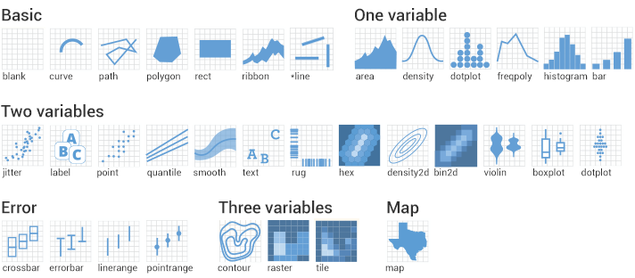

      <style type="text/css">
.remark-slide-content {
    font-size: 25px;
    padding: 1em 2em 1em 2em;
}
</style>      

#Required packages

- tidiverse (Includes packages ggplot2, dplyr and tidyr)
- palmerpenguins


```{r, include=F}
#Load packages

library(tidyverse)
library(palmerpenguins)


```

```r
#Install packages

install.packages("tidyverse") # Ploting and data manipulation
install.packages("palmerpenguins") # Dataset

#Load packages

library(tidyverse)
library(palmerpenguins)

```
---
# Data format
.pull-left[ 
- To use ggplot2 make sure your data is in **long** format

- If you are not sure what that means check this [link](https://fromthebottomoftheheap.net/2019/10/25/pivoting-tidily/)

]
.right[ 
```{r, echo=FALSE, out.width='52%'}
knitr::include_graphics('pivot.png')
```
]

---
```{css, echo=FALSE}
pre {
    max-width: 100%;
    max-height: 210px;
  overflow-x: scroll;
  overflow-y: scroll;
}
```
# The dataset

.center[ 
```{r, echo=FALSE, out.width='35%'}
knitr::include_graphics('penguins.png')
```
]

.pull-left[
   [Palmer penguins website](https://allisonhorst.github.io/palmerpenguins/)
]

```{r}
# Check the palmer penguins dataset
str(penguins)
```

---
# Preliminary data treatment

```{r}
# Remove NAs from data set
penguins_nafree <- penguins %>% drop_na() #Uses dplyr and tidyr

str(penguins_nafree)
```

---
# GGPLOT2
## How does it work?
Every ggplot call needs at least 3 elements:
 - data
 - mapping (aesthetics)
 - geometric representation (geom)

---
## Let's start with the data and mapping

```{r, warning=F, fig.width = 6, fig.height = 5, fig.align='center', fig.retina = 3}
# Let's plot body mass as a function of penguin species 
ggplot(data=penguins_nafree , mapping = aes(x=species, y=body_mass_g))

```
---
## Let's add a geom

- Let's do a boxplot with **geom_boxplot**

```{r, warning=F, fig.width = 6, fig.height = 4, fig.align='center', fig.retina = 3}
# it is not necesary to write data and mapping, as ggplot knows
# that first argument in function is the data and that aes correspond to mapping
ggplot(data=penguins_nafree ,mapping =aes(x=species, y=body_mass_g)) + # + adds new layer
geom_boxplot()
```

---
## Many ways to ggplot

```r
#Original
ggplot(data=penguins_nafree ,mapping =aes(x=species, y=body_mass_g)) + 
geom_boxplot()

#Shorter alternative
* ggplot(penguins_nafree, aes(x=species, y=body_mass_g)) + 
* geom_boxplot()

# Aesthetics can go inside each geom
ggplot(penguins_nafree ) + 
geom_boxplot(aes(x=species, y=body_mass_g))

# Data and Aesthetics can go inside each geom
ggplot() + 
geom_boxplot(data=penguins_nafree, aes(x=species, y=body_mass_g))

```

```{r, echo=F, fig.width = 6, fig.height = 4, fig.align='center', fig.retina = 3}
# Aesthetics can go inside each geom
ggplot(penguins_nafree ) + 
geom_boxplot(aes(x=species, y=body_mass_g))
```

---
## Other aesthetics

- **color=** will change the color of the lines
- **fill=** will fill each box with a different color

Let's see differences between sexes for each species
```{r, warning=F, fig.width = 5, fig.height = 3, fig.align='center', fig.retina = 3}
# Let's try with color
ggplot(penguins_nafree, aes(x=species, y=body_mass_g, color=sex)) + 
geom_boxplot()
```
More [aesthetic specifications](https://ggplot2.tidyverse.org/articles/ggplot2-specs.html) (not all apply for geom_boxplot)

---
## Add more geoms
```{r, warning=F, fig.width = 6, fig.height = 3.5, fig.align='center', fig.retina = 3}

ggplot(penguins_nafree, aes(x=species, y=body_mass_g, color=sex)) + 
geom_boxplot()+
  geom_jitter() #Similar to geom_point but prevents points from overlapping
```

---
# More geoms
.center[
```{r, echo=FALSE, out.width='90%'}

```
]

## Even more [geoms and tools](https://www.r-graph-gallery.com/ggplot2-package.html) 

---
# Challenge

Experiment with different geoms on the penguins_nafree dataset

*(Maybe paste figures on shared googledocs or something similar for discussion)*

---
# Final idea

*Fit linear model (not sure if to fit a simple lm or a mixed effects)*

```{r, include=F}

#Fit linear model----

mod<-lm(bill_depth_mm~bill_length_mm+species+sex,data=penguins_nafree) 

#Calculate predictions for prediction line and confidence interval

pred<-predict(mod, interval="confidence")   

head(pred) 
 #fit= prediction line, 
 #lwr= lower value of ci and 
 #upr= upper value of ci

#Bind columns with predictionsto dataframe
penguins_pred<-cbind(penguins_nafree,pred) 
head(penguins_pred) 

```

```r
#Fit linear model----

mod<-lm(bill_depth_mm~bill_length_mm+species+sex,data=penguins_nafree) 

#Calculate predictions for prediction line and confidence interval

pred<-predict(mod, interval="confidence")   

head(pred) 
 #fit= prediction line, 
 #lwr= lower value of ci and 
 #upr= upper value of ci

#Bind columns with predictionsto dataframe
penguins_pred<-cbind(penguins_nafree,pred) 
head(penguins_pred) 

```
---
#Plot regression lines and confidence intervals
```{r, message=F, fig.width = 6, fig.height = 3.5, fig.align='center', fig.retina = 3}

#Plot----
ggplot(penguins_pred, aes(x=bill_length_mm,y=bill_depth_mm, fill=sex)) +
  facet_grid(species~.)+
  geom_point(shape=21, alpha=0.8, size=1.2)+
  geom_ribbon(aes(ymin=lwr, ymax=upr), alpha=0.5)+
  geom_smooth(aes(y=fit, color=sex))+
  labs(x= "Bill length (mm)", y="Bill depth (mm)")+
  scale_color_manual("Sex",labels= c("F", "M"), values= c("brown2", "blue"))+
  scale_fill_manual("Sex",labels= c("F", "M"), values= c("brown2", "blue"))+
  theme_bw()+ 
theme(panel.grid = element_blank(),text =element_text(size=10),
legend.position=c(0.89,0.93),legend.direction = "horizontal",
legend.margin = margin(0,0,0,0),
legend.key.size = unit(0.4, "cm"))
  
```
